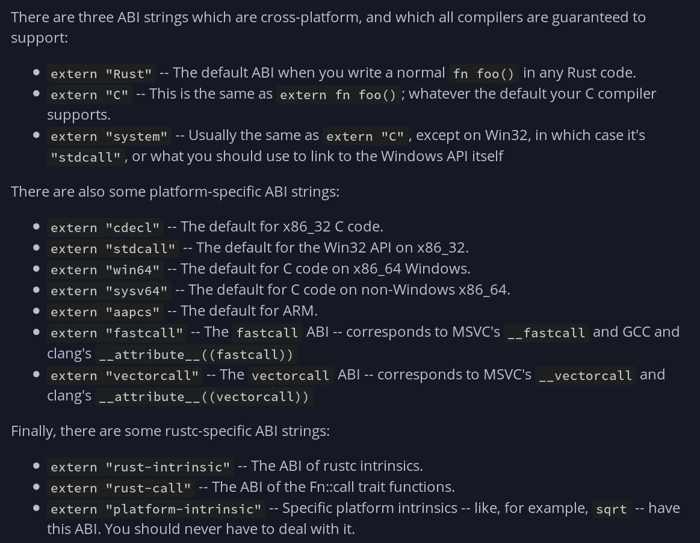
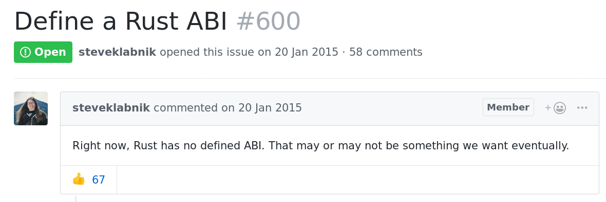
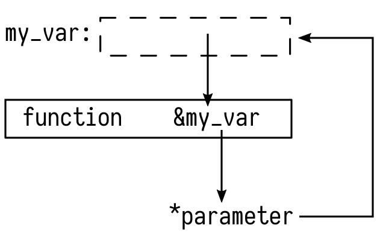
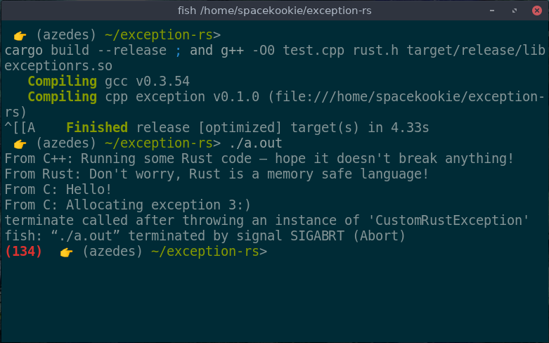

## `whoami(1)`

Katharina Fey ( `@spacekookie` )

* Active FOSS developer
* Avid tea drinker
* Hobbyist hardware maker 

---

## `whoami(2)`

I do Rust things!

* Contributer to the CLI-WG
* Author of (too) many `use[ful|less]` crates
* Member of `berlin.rs`

---

## Why

---

## Why would you do that?

---

* Integrate into larger projects
* Replace application piece by piece
* Write plugins

---

## Why give this talk?

---

Rust promises efficient FFI to C code

What does this mean?

---

## ABI

---


## ABI

Application _Binary_ Interface

<br/>

* Defines the function signature & types
* Much like an API but for linkers

---

## ABI

```rust
extern "C" fn foo() { /* ... */ }

#[repr(C)]
struct Bar { /* ... */ }

#[repr(C)]
enum Biz { /* ... */ }

union Fuzz { /* unions are just cool by default */ }
```

---

## ABI



---

## ABI

Let's talk about stability



---

Neither does C++

---

C doesn't _have_ an ABI

The operating system does

---

## C code from Rust

<br/>
<br/>
<br/>
<br/>
<br/>
<br/>
<br/>
<br/>
<br/>
<br/>
<br/>
<br/>
<br/>
<br/>
<br/>
<br/>
<br/>
<br/>
<br/>
<br/>
<br/>
<br/>
<br/>

---

## Boring FFI

<div class="fragment" data-fragment-index="2">
* Bind to native API with `extern` functions
* Wrap function calls in `unsafe`
* Make data C-compatible
</div>

<div class="fragment" data-fragment-index="3">

```rust
extern "C" {
    fn reverse(const *c_char) -> const *c_char;
}

fn stuff(value: &str) {
    println!("{:?}", 
        unsafe { reverse(CStr::from(value).unwrap()) }
    );
}
```

</div>

<br/>
<br/>
<br/>

---

## Boring FFI

<br/>

`std::os::raw` & `std::ffi` contain FFI types

> * (Rust) `String` becomes `CString`
> * (Rust) `&str` becomes `CStr`
> * `void` becomes `c_void`
> * ... etc ...

<br/>
<br/>
<br/>
<br/>
<br/>

---

## Turning tables

* Same `extern "C"` as before
* Take data in C-form
* Use `#[no_mangle]` to preserve the function name

<div class="fragment" data-fragment-index="2">

```rust
#[no_mangle]
pub extern "C" fn reverse(word: *const c_char) -> *const c_char {
    /* ... implementation really not important right now ... */
}
```

</div>

---

## Turning tables

Some special fields in `Cargo.toml`

```yml
# ...

[lib]
name = "reverso"            # Practise my reversing. Ha-HAA!
crate-type = ["cdylib"]     #  dynamic library (.so)
#            ["staticlib"]     static library (.a)
```

---

## Turning tables

Integrating the Rust code into your build toolchain

```
├── CMakeLists.txt
├── reverso
│   ├── Cargo.toml 
│   └── src 
│       └── lib.rs
├── reverso.h
└── main.c
```

<div class="fragment" data-fragment-index="2">
Note the header `reverso.h`

```C
// Safely reverse a unicode string
const char *reverse(const char *in);
```

</div>

---

##  Turning tables

Calling this from C is easy

```C
#include "reverso.h"
void main() {
    char * greeting = "привет RustConf 👩🏽‍💻";
    printf("'%s' reversed: '%s' \n", greeting, reverse(greeting));
}
```

<div class="fragment" data-fragment-index="2">

```console
'ривет RustConf 👩🏽‍💻' reversed: '💻👩🏽 fnoCtsuR тевирп'
```

</div>

---

## Thank you

Tweet at me @spacekookie

Like, Share & Subscribe...

---

## Alright, not quite

---

## Some Problems

* I don't want to write headers
* How to deal with anything going wrong?
* Oh god, *real* memory management! 😨
* How to build pretty APIs?

---

## Tooling

---

## cbindgen

Don't write headers yourself. Use `cbindgen`

* Like bindgen, but in reverse
* Can generate `.h` files at compile-time

---

## Build system support 

😏

---

## Memory management

---

## Memory management

Put your troubles in a box ✨

```rust
#[repr(C)]
struct MyThing {
    /* ... */
}

#[no_mangle]
extern "C" fn make_thing() -> Box<MyThing> {
    Box::new(MyThing {
        /* ... */
    })
}
```

<br/>
<br/>

---

## 📦 Boxes 📦

```rust
let ptr: c_void = /* ... */;

let thing: &mut MyThing = unsafe {
        &mut *ctx as &mut MyThing
    };

thing.foo();
```

---

Remember: C is now responsible for the memory.

*You can't make the native code memory safe*

```C
void main() {
    MyThing *t = make_thing();
    free(t);

    printf("%s", t.value); // kaboom!
}
```

<br/>
<br/>

---

## Communicating Errors

---

```rust
enum Result<T, E> {
    Ok(T),
    Err(E),
}
```

```rust
enum Option<T> {
    Some(T),
    None,
}
```

---

> * Errors in C
> * Errors in C++

---

Emulate `Result<T,E>` with a structure

```rust
#[repr(C)]
pub struct rvalue_t<T> {
    thing: Box<Option<T>>,
    code: u32,
}
```

<div class="fragment" data-fragment-index="2">

C
```C
struct rvalue_t {
    void         *ignore_me;
    unsigned int code;
};
```

</div>

---

```C
rvalue_t val = myfunction();
if (val.code) {
    // Handle errors
}
```

---

## 👉 Pointers 



---

## Errors in C

```C
uint32_t get_client(server_t *ctx, client_t **client);

/* ... */

client_t *client;
ret = get_client(ctx, &client);
if(ret) {
    // Handle errors
}
```

---

## Errors in C

```C
uint32_t initialise(server_t **ctx, uint16_t port);

/* ... */

server_t *server;
ret = initialise(&server, 1337);
if(ret) {
    // Handle errors
}
```

--- 

## Errors in ~~C~~ Rust

```Rust
/// Initialise <thing>
#[no_mangle]
pub extern "C" fn initialise(ctx: *mut *mut c_void, 
                             port: c_uint) -> c_uint {

    /* ... check if port valid ... */ 

    let server = Box::new(server_t { port });
    unsafe { *ctx = Box::into_raw(server) as *mut c_void };
    return 0;
}
```

---

```C
/* rust.h */
struct server_t {
    uint16_t port;
};
uint32_t initialise(struct server_t **, uint16_t);

/* main.c */

struct server_t *server;
uint32_t ret = initialise(&server, 8080);
if(ret) {
    // Handle errors
}
```

---

## Errors in C++

Well...

---

## Errors in C++

Wrap C-errors in exception throwing code

```C++
extern "C" {
    #include "cbindgen-made-this.h"
}

class MyRustModule {
    void do_something_dangerous() {
        auto ret = do_rust_things();
        if(ret) throw CorporateExceptionSeven(ret);
    }
}
```

---

## Errors in C++

```C++
namespace Rust {
    extern "C" {
        #include "no_i_made_this.h"
    }
}

/* ... */

auto ret = Rust::do_something_dangerous();
if(ret) return new MyResultNine(ret, "Oh no!");
```

---

---

### Can you throw a `C++` exception from Rust?

---

## 😱

---

## Yes!

---

## Exceptions

<div class="fragment" data-fragment-index="2">
`try` - `throw` – `catch`
</div>

<div class="fragment" data-fragment-index="3">
`try` creates a "landing pad"
</div>

<div class="fragment" data-fragment-index="4">
`throw` walks up the stack
</div>

<div class="fragment" data-fragment-index="5">
Then calls `catch`
</div>

---

## `try`

Landing pad determines how to continue

---

## `catch`

But which one? Filter or rethrow!

---

## Throw

Replaced with calls into `libc++`

---

## This is a talk about Rust

---

## exception.rs

```rust
extern crate exception_rs as exception;

pub extern "C" fn oh_no() {
    exception::throw(RustException { text: "Oh noes!" });
}
```

<small>Oh god please don't use this! (soon™ on crates.io)</small>

---

No `libc++` bindings in Rust

<div class="fragment" data-fragment-index="2">
Invoke apropriate functions via `C` shim layer
</div>

<div class="fragment" data-fragment-index="3">
```C
extern void *__cxa_allocate_exception(size_t thrown_size);
extern void __cxa_throw(void *e, void **t, void (*dest)(void *));
```

Functions are linked when C++ project is compiled
</div>

---



---

---

### Can you *catch* a C++ exception in Rust?

---

Yes. But not today

---

## Thank you (for real)

Follow me on twitter **`@spacekookie`**

Or: **`kookie@spacekookie.de`**

<br/>

* 💚 My employer: **Ferrous Systems**
* 🧡 Mozilla
* ❤ All of you
